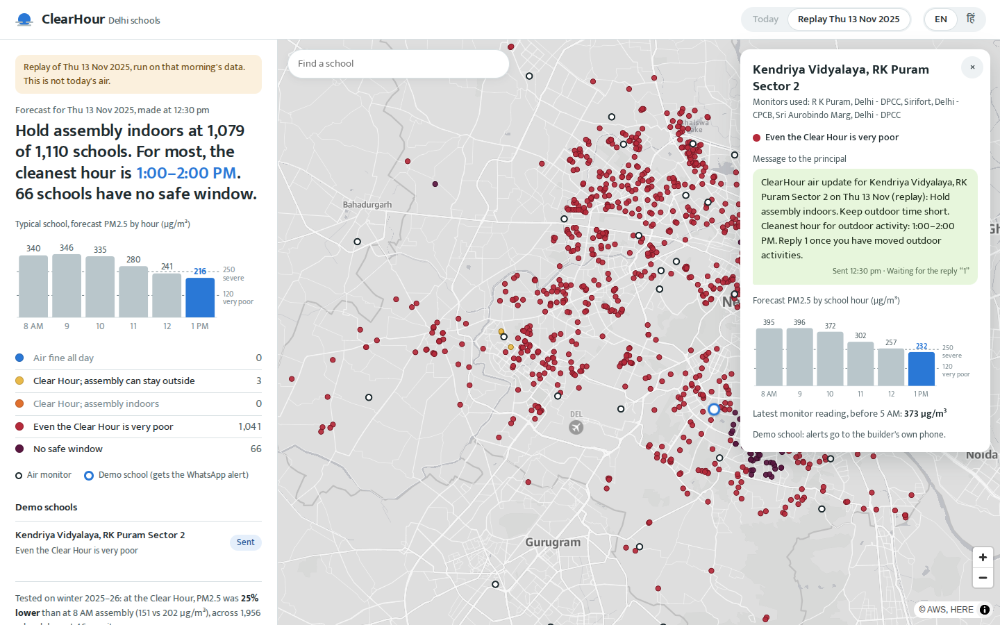
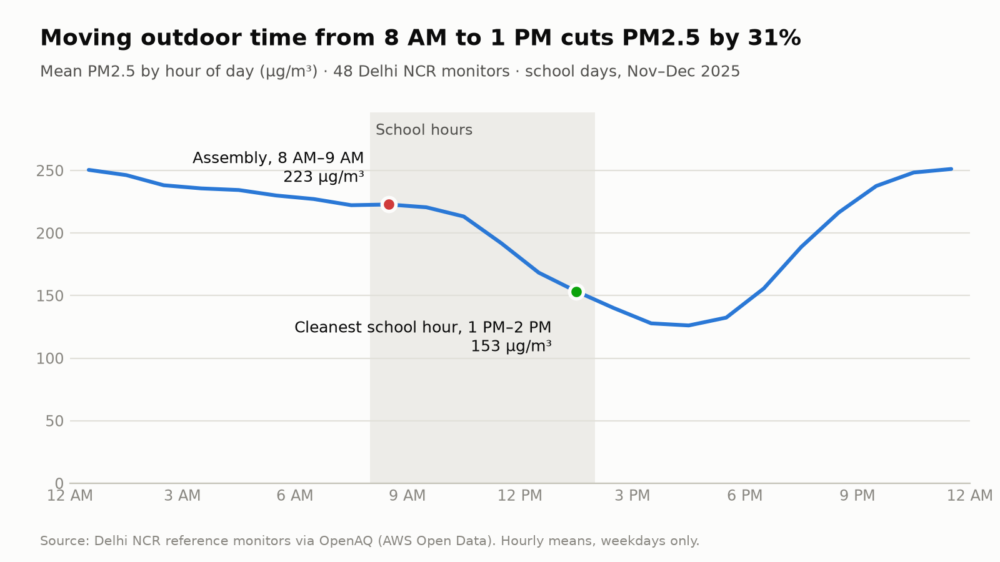
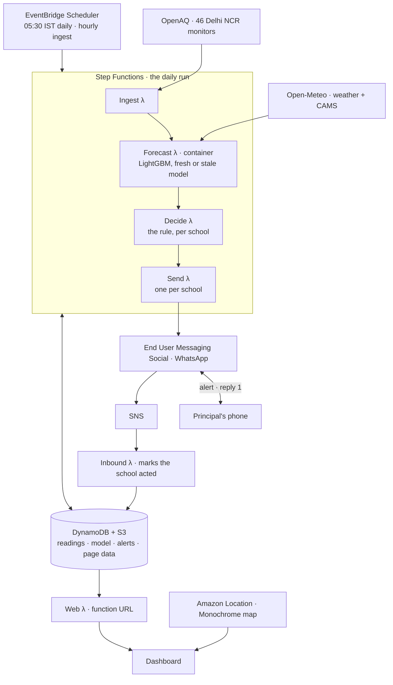

# ClearHour

**The cleanest hour of the school day, for 1,110 Delhi schools.** Every morning at 5:30, ClearHour forecasts
PM2.5 hour by hour across Delhi. Within minutes it sends each subscribed principal one WhatsApp message, in
Hindi or English. The message says which school hour has the cleanest air, whether to hold assembly indoors,
or that there is no safe window today.

This is a working demo. One real Delhi school is set up as a recipient, and its alerts go to the builder's
own phone; no school has signed up yet. The dashboard shows each morning's run, updated at 5:30, and a replay
of 13 Nov 2025, a smoggy winter day.

**Dashboard:** https://rshczjirhol3xg3tzbuwhv4txi0ooeac.lambda-url.ap-south-1.on.aws/

Built solo for Environmental Hacks (Bharat Builds Tour, WeMakeDevs × AWS), Air track.



## Why

On winter mornings in Delhi, PM2.5 is near its daily peak just as schools hold assembly and morning PE.
Across last winter's school days, 1 PM averaged 23% less PM2.5 than 8 AM, though not on every day. When the
air turns severe, the main lever is a GRAP order moving classes online or to hybrid. ClearHour adds the step
in between: on any school morning, it tells each principal which hour is cleanest and what to keep indoors.



## What a principal would receive

> ClearHour air update for Kendriya Vidyalaya, RK Puram Sector 2 on Thu 13 Nov (replay): Hold assembly
> indoors. Keep outdoor time short. Cleanest hour for outdoor activity: 1:00–2:00 PM. Reply 1 once you have
> moved outdoor activities.

The same alert goes out in Hindi for schools that choose it. When the principal replies **1**, the school is
marked as acted on, and the dashboard shows it within about 20 seconds.

## Does it work?

We tested the forecast out of sample with a walk-forward backtest over winter 2025–26 (10 Nov to 1 Feb).
Each week was predicted by a model trained only on earlier days. The test covered 46 monitors over 12 weeks
of school days, 1,956 monitor-days in all, scored at the monitors (each school blends up to three of them).

| Where outdoor time goes | Average PM2.5 there (µg/m³) | Less than 8 AM, on average | Less than 8 AM, median day | Days dirtier than 8 AM |
|---|---|---|---|---|
| 8 AM assembly, today's habit | 202 | – | – | – |
| The hour CAMS forecasts as cleanest | 156 | 22.8% | 20.7% | 33.5% |
| Always 1 PM | 155 | 22.9% | 20.9% | 33.6% |
| ClearHour's Clear Hour | **151** | **25.0%** | 17.6% | 29.0% |
| The cleanest hour in hindsight | 133 | 33.9% | 24.9% | 0% |

| Forecast error, mean absolute (µg/m³) | |
|---|---|
| ClearHour model | **49.1** |
| Last reading carried forward | 59.5 |
| Same hour yesterday | 63.8 |
| CAMS global forecast | 94.0 |

What the numbers say, honestly:
- **Most of the gain comes from the afternoon itself.** Always choosing 1 PM gets 22.9% on average.
  ClearHour leads on the average, which weights the smoggiest mornings most, and is dirtier than 8 AM on
  fewer days. On the median day, though, a fixed 1 PM cuts more (20.9% against 17.6%).
- **Assembly is decided by the latest reading,** taken before 5 AM, rather than by the forecast. That reading
  got the "hold assembly indoors" call right on 88.7% of mornings, against 86.2% for the 8 AM forecast and
  76.3% for always saying "indoors".
- **These results assume on-time readings.** OpenAQ receives Delhi's readings in delayed batches, sometimes a
  day or more late. On those mornings a second model, trained on late data, still forecasts how polluted each
  school hour will be, which decides "air is fine", "assembly indoors" and "no safe window". Its error is
  59–62, against 72–96 for the last reading carried forward and 94 for CAMS. It doesn't choose the hour: the
  Clear Hour defaults to 1 PM, which beat the late model's own pick at every delay we tested, from 6 to 36
  hours. The dashboard says when this happens.

Every decision behind these numbers, including the ones that went against us, is in
[DECISIONS.md](docs/DECISIONS.md).

## How it runs on AWS



| Service | What it does here |
|---|---|
| EventBridge Scheduler | Starts the daily run at 05:30 IST, and the hourly ingest |
| Step Functions | Runs ingest, forecast, decide, then one send per school, with retries |
| Lambda | Six functions. The forecast is a container image carrying LightGBM; the web function serves the dashboard from a function URL |
| DynamoDB | Hourly readings, school profiles, and each alert's status (pending, sent, acted) |
| S3 | The models, each run's forecast and decisions, and the dashboard's data |
| End User Messaging Social | Sends the WhatsApp alert and receives the reply |
| SNS | Carries replies to the Inbound function |
| Amazon Location Service | The dashboard's Monochrome basemap |
| ECR, CloudFormation (SAM) | The forecast image and the whole stack, deployed from `template.yaml` |

Alerts are idempotent. Each school's alert for the day moves pending → sending → sent through conditional
writes, so a retried run never sends twice.

## The decision rule

For each school, ClearHour blends the forecasts of the nearest monitors, up to three within 10 km, weighted
by distance. Then:

1. **Air is fine** if every school hour is forecast at or below 90 µg/m³, and the latest reading is also at or
   below 90.
2. **There is no safe window** if every school hour is forecast above 250 µg/m³, the "severe" band: keep
   assembly, PE and recess indoors.
3. **Otherwise, the cleanest school hour is the Clear Hour.** Assembly is held indoors if the latest reading is
   above 120 µg/m³; then 8 AM can't be the Clear Hour. If even the Clear Hour is above 120, the alert adds
   "Keep outdoor time short."

On a morning without the night's readings, the 8 AM forecast makes the assembly call and the Clear Hour is
1 PM.

The thresholds follow India's National Air Quality Index bands for PM2.5. Those bands are defined for 24-hour
averages, so ClearHour applies them to hourly values as a guide. It reports a difference in concentration, not
a health outcome.

## Data

- **Air quality:** hourly PM2.5 from public monitors in Delhi NCR run by CPCB, DPCC and others, via
  [OpenAQ](https://openaq.org) (its S3 archive for history, its API live).
- **Weather and CAMS forecasts:** [Open-Meteo](https://open-meteo.com). Contains modified Copernicus
  Atmosphere Monitoring Service information, 2025–2026.
- **Schools:** 1,110 Delhi schools mapped in [OpenStreetMap](https://www.openstreetmap.org/copyright) (ODbL).
- **Basemap:** Amazon Location Service.

## Limits

- **Demo school only.** One real Delhi school is set up as a demo recipient, and its alerts go to the
  builder's own phone. No school has signed up.
- **Partial school list.** OpenStreetMap has 1,110 of Delhi's schools. The government's UDISE+ register would
  cover them all.
- **Late readings.** Delhi's readings often arrive late through OpenAQ, and on those mornings ClearHour falls
  back as described above. A direct CPCB feed would fix that. When only some monitors are late, the morning run
  currently covers only the schools near the on-time ones (67 of 1,110 on 10 Oct 2026); judging staleness per
  monitor is the next fix.
- **One city, one season.** The model is trained on Delhi NCR from October to February.

## Run it

You need Python 3.13 with [uv](https://docs.astral.sh/uv/), Docker, the AWS SAM CLI, and an AWS profile
named `clearhour`.

```bash
uv sync
uv run pytest -q          # 31 tests, including the whole pipeline on mocked AWS
cp .env.example .env      # add OPENAQ_API_KEY; with WA_MODE=dry_run, alerts are logged, not sent
bash scripts/deploy.sh    # builds, deploys, uploads the model and the page, prints the dashboard URL
```

To rebuild the data and the models from scratch:

```bash
uv run --env-file .env scripts/find_stations.py     # data/stations.csv: Delhi NCR PM2.5 monitors (OpenAQ API)
uv run --env-file .env scripts/check_timestamps.py  # prints the archive's timestamp convention; it is set in scripts/config.py
uv run scripts/pull_archive.py                      # data/processed/pm25_hourly.parquet and outputs/coverage.csv
uv run scripts/hook_stat.py                         # outputs/hook_stat.json, hook_chart.png and hour_profile_2025.csv
uv run scripts/fetch_meteo.py                       # data/processed/meteo.parquet: weather and CAMS (Open-Meteo)
uv run scripts/backtest.py                          # outputs/backtest.json and outputs/backtest_by_lead.csv
uv run scripts/train_final.py                       # models/: the fresh and stale models and their feature lists
uv run scripts/schools.py                           # data/schools.csv (OpenStreetMap) and data/pilot_schools.csv
uv run scripts/build_reference.py                   # src/clearhour/stations.json and schools_index.json, for the Lambdas
uv run --env-file .env scripts/seed_pilots.py       # the demo schools' profiles in DynamoDB (after the first deploy)
```

## Repo map

- `src/clearhour/`: the library, the Lambda handlers (`handlers/`) and the reference files the Lambdas carry
- `functions/forecast/`: the Forecast Lambda's container image
- `statemachine/`: the Step Functions definition of the daily run
- `site/`: the dashboard, one static page
- `scripts/`: data pulls, the backtest, training, deploy and publish
- `tests/`: pytest, including the whole pipeline on mocked AWS
- `data/`: the monitor, school and pilot lists (raw and processed data stay out of git)
- `models/`: the models' feature lists (the model files are built, not committed)
- `outputs/`: the charts, backtest results, coverage table and dashboard screenshots
- `docs/`: the build briefs (`docs/briefs/`) and every decision (`docs/DECISIONS.md`)

## Built with AI tools

- **Claude** (claude.ai) for the architecture, the analysis plan and the build briefs, all in
  [docs/briefs/](docs/briefs/).
- **Claude Code** for the implementation, tests, data pulls and deploys.
- **Amazon Polly** (generative voice "Kajal") for the demo video's narration; everything on screen is a real recording.

## License

MIT. See [LICENSE](LICENSE).
